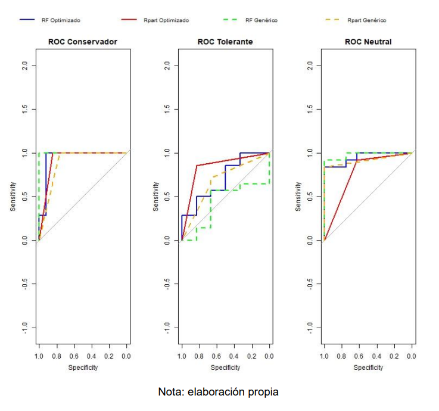
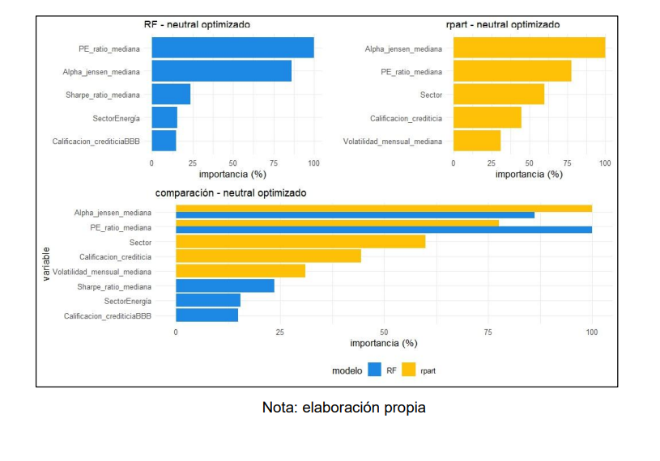

# Decision Trees for Stock Classification (IBEX 35) - Partial Bachelor’s Thesis

📄 [Download Thesis PDF (Spanish, partial version)](https://github.com/ygs1629/BT-2025/blob/main/BT_2025-Partial_version_in_Spanish.pdf)

## Overview
This repository contains a partial version of my Bachelor’s Thesis (in Spanish), focusing on classifying IBEX 35 stocks according to investor risk profiles (conservative, neutral, tolerant).

### Objective
- Classify stocks for different investor risk profiles using decision trees and random forests.

### Data
- Monthly financial data (2016–2024): returns, volatility, Sharpe ratio, PER, Jensen’s alpha.

### Techniques
- Decision Trees (`rpart`)  
- Random Forest (bagging, feature importance)  
- Stratified cross-validation with hyperparameter tuning

### Evaluation Metrics
- AUC, F1-score, sensitivity, specificity, confusion matrices

### Major Findings
- Credit rating, Sharpe ratio, and accumulated returns are key factors for stock inclusion/exclusion.

### Some Key Visual Takeaways
#### ROC Curves
_Comparison of ROC curves between all models and investor types:_  

#### Variable Importance (Neutral Investor)
_Comparison of stock returns against risk tolerance:_  

## Skills & Tools
- **Languages & Tools**: R (rpart, randomForest), Git, Excel/Power BI  
- **Skills**: Data preprocessing, feature selection, model validation, performance evaluation

---

**Note**: PDF in Spanish; description here is in English for international visibility. Full version available upon request.
