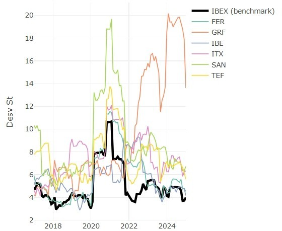
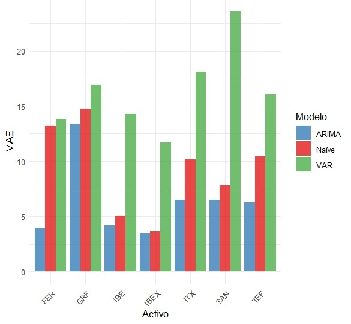

# IBEX 35 Stock Returns Forecasting

[Full project version here](https://github.com/ygs1629/University-degree-projects/blob/main/Time-Series-Forecasting-of-IBEX-35-Stocks/docs/index.html)

## Overview
Comprehensive time series analysis and forecasting of major Spanish stocks (2016-2024) comparing multiple statistical approaches for logarithmic returns prediction.

## Objective
- Analyze distributional properties of stock returns
- Compare forecasting performance of Naïve, ARIMA, and VAR models
- Evaluate practical applicability in financial markets

## Data
- **Source**: Yahoo Finance (monthly data)
- **Period**: January 2016 - December 2024
- **Assets**: IBEX 35 + 6 leading stocks (SAN, ITX, IBE, GRF, FER, TEF)
- **Transformation**: Logarithmic returns (`diff(log(Adjusted_Close)) * 100`)

## Techniques
- **Exploratory Analysis**: Normality tests, rolling volatility, correlation dynamics
- **Forecasting Models**: 
  - Naïve (baseline)
  - ARIMA (univariate with auto parameter selection)
  - VAR (multivariate with optimal lag selection)
- **Validation**: Train (2016-2021) / Validation (2022-2023) / Test (2024) split

## Evaluation Metrics
- **RMSE** (Root Mean Square Error)
- **MAE** (Mean Absolute Error)
- Model comparison on validation set

## Key Visual Takeaways

### Rolling Volatility Patterns (12-month)

*Volatility clustering during crisis periods (2020) and sector-specific patterns*

### MAE comparison across all models (validation set)

*ARIMA consistently outperforms the other models*

### Limitations and Final Remarks

Although note mentioned in the HTML, ARIMA proves valuable as a competitive benchmark but shows clear limitations for financial returns, typically capturing little beyond the near-zero mean. Its forecasting gains over naïve models are modest in context, highlighting that more specialized approaches (e.g., GARCH) are better suited to address volatility clustering and heavy tails. In practice, ARIMA should be viewed as a reference baseline rather than a final predictive tool.

## Skills and Tools
- **Languages**: R
- **Libraries**: forecast, vars, quantmod, ggplot2, plotly, xts, zoo
- **Skills**: Time series decomposition, statistical testing, model validation, financial data visualization
- **Methods**: Distribution analysis, autocorrelation diagnostics, multivariate forecasting

---
**Note**: HTML in Spanish; description here is in English for international visibility and portfolio presentation. The graphics shown are all own-elaborated. This is solely an educational project, not for investment purposes.The main motivation was to apply predictive modeling techniques learned at university to real-world financial data, exploring their strengths and limitations in a practical context.
